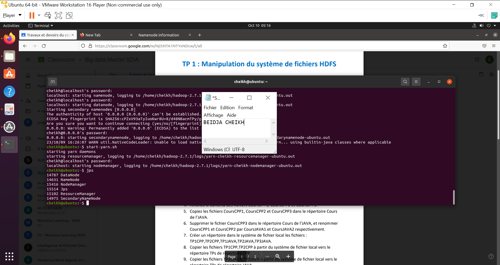
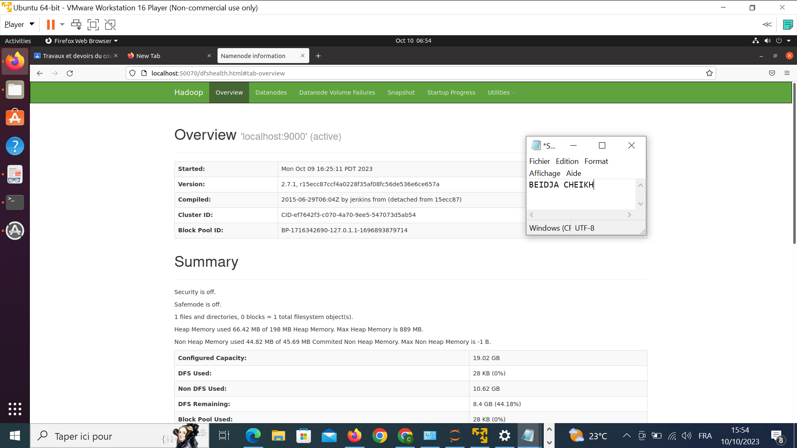
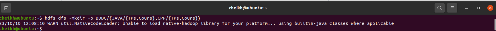
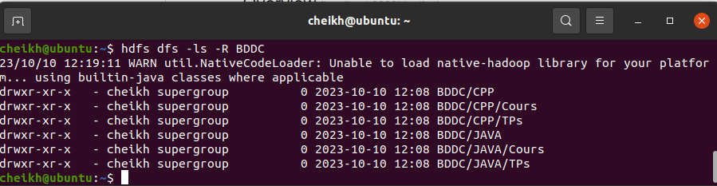
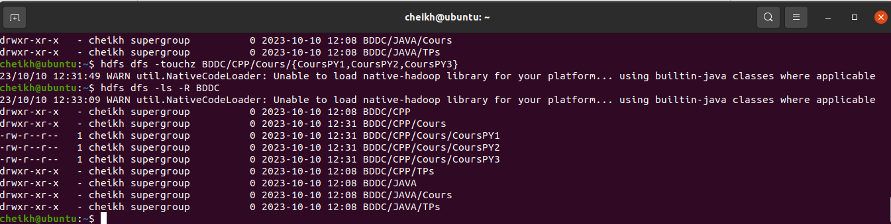

<h1 style="background-color: rgb(128,128,128); padding: 10px;">TP 1 : Manipulation du système de fichiers HDFS</h1> 
<h2>1. Démarrez les processus Hadoop avec les commandes start-dfs.sh et start-
yarn.sh. Ensuite, vérifiez qu’il est en cours d’exécution avec la commande jps et
accéder à l’interface web de NameNode avec http://localhost :50070.</h2> 
<h3>commande start-dfs.sh</h3>

<h3>commande yarn.sh</h3>

<h3>http://localhost :50070</h3>

<h2>2. Créez dans la racine du HDFS l’arborescence suivante :</h2> 
<h6>hdfs dfs -mkdir -p BDDC{JAVA/{TPs,Cours},CPP/{TPs,Cours}}</h6>
 
<h6> hdfs dfs -ls -R SDIA</h6>
 
<H2>3. Créez dans le répertoire Cours de CPP les fichiers CoursCPP1, CoursCPP2 et
CoursCPP3. Puis ajoutez du contenu dans les fichiers crées.</H2>
<h6>hdfs dfs -touchz BDDC/CPP/Cours/{CoursPY1,CoursPY2,CoursPY3}</h6>
 