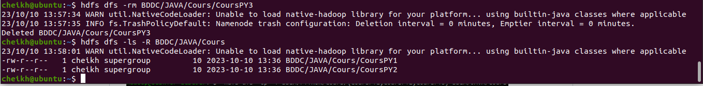

<h1 style="background-color: rgb(128,128,128); padding: 10px;">TP 1 : Manipulation du système de fichiers HDFS</h1> 
<h2>1. Démarrez les processus Hadoop avec les commandes start-dfs.sh et start-
yarn.sh. Ensuite, vérifiez qu’il est en cours d’exécution avec la commande jps et
accéder à l’interface web de NameNode avec http://localhost :50070.</h2> 
<h3>commande start-dfs.sh</h3>

<h3>commande yarn.sh</h3>

<h3>http://localhost :50070</h3>

<h2>2. Créez dans la racine du HDFS l’arborescence suivante :</h2> 
<h6>hdfs dfs -mkdir -p BDDC{JAVA/{TPs,Cours},CPP/{TPs,Cours}}</h6>
 
<h6> hdfs dfs -ls -R SDIA</h6>
 
<H2>3. Créez dans le répertoire Cours de CPP les fichiers CoursCPP1, CoursCPP2 et
CoursCPP3. Puis ajoutez du contenu dans les fichiers crées.</H2>
<h6>hdfs dfs -touchz BDDC/CPP/Cours/{CoursPY1,CoursPY2,CoursPY3}</h6>
 
Puis ajoutez du contenu dans les fichiers crées.
<h6>echo "Hi SDIA!" | hadoop fs -appendToFile - SDIA/PYTHON/Cours/CoursPY2</h6>
 
<h2>4. Affichez le contenu des fichiers CoursCPP1, CoursCPP2 et CoursCPP3.</h2>
 
<h2>5. Copiez les fichiers CoursCPP1, CoursCPP2 et CoursCPP3 dans le répertoire Cours
de l’JAVA.</h2>
<h6>hdfs dfs -cp -f BDDC/CPP/Cours/{CoursPY1,CoursPY2,CoursPY3} BDDC/JAVA/Cours</h6>
 
<h2>6. Supprimer le fichier CoursCPP3 dans le répertoire Cours de l’JAVA, et renommer
CoursCPP1 et CoursCPP2 par CoursJAVA1 et CoursJAVA2 respectivement.</h2>
<h6>Supprimer le fichier CoursCPP3 dans le répertoire Cours de l’JAVA</h6>  
hdfs dfs -rm SDIA/JAVA/Cours/CoursPY1   
 
<h6>renommer CoursCPP1 par CoursJAVA1</h6>
hdfs dfs -mv BDDC/JAVA/Cours/CoursCPP1 BDCC/JAVA/Cours/CoursJAVA1  
  

<h6>renommer CoursCPP2 par CoursJAVA2</h6>
hdfs dfs -mv BDDC/JAVA/Cours/CoursCPP2 BDCC/JAVA/Cours/CoursJAVA2 
  

<h2>7. Créer un répertoire dans le système de fichier local les fichiers :
TP1CPP,TP2CPP,TP1JAVA,TP2JAVA,TP3JAVA.</h2>
<h6>touch {TP1CPP,TP2CPP,TP1JAVA,TP2JAVA,TP3JAVA}</h6>
  
<h2>8. Copier les fichiers TP1CPP,TP2CPP à partir du système de fichier local vers le répertoire TPs de répertoire CPP.</h2>
hdfs dfs -copyFromLocal {TP1CPP,TP2CPP} BDDC/CPP/TPs  
  
<h2>9. Copier les fichiers TP1CJAVA,TP2JAVA à partir du système de fichier local vers le
répertoire TPs de répertoire JAVA.</h2>
  
<h2>10.Afficher tout le contenu du répertoire BDDC d’une manière récursive.</h2>
hdfs dfs -ls -R BDDC
  
<h2>11. Supprimer le fichier TP1CPP du répertoire TPs.</h2>
  
<h2>12. Supprimer le répertoire Java avec son contenu.</h2>
  

